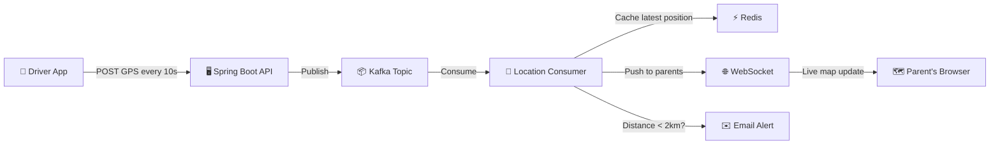

# 🚌 Live Bus Tracking System — How It Works

> A simple, beginner-friendly explanation of the real-time school bus tracking feature.

---

## 🎯 The Problem
Parents want to know: **"Where is the bus right now?"** and get an alert like **"Bus is 2km away from your stop!"**

## 💡 The Solution (Real-World Analogy)

Imagine you order food on **Swiggy/Zomato**. You can see the delivery guy moving on a map in real-time. That is *exactly* what we are building — but for school buses!

---

## 🧩 The 5 Key Technologies Used

| Technology | Role | Real-World Analogy |
|---|---|---|
| **Spring Boot** | The brain of the system | The Zomato server that processes everything |
| **Apache Kafka** | High-speed message pipeline | A conveyor belt in a factory — GPS data flows through it non-stop |
| **Redis** | Temporary fast storage | A whiteboard — always shows the *latest* bus position |
| **WebSockets (STOMP)** | Real-time push to browser | WhatsApp — server *pushes* messages to you, you don't keep refreshing |
| **Haversine Formula** | Distance calculator | Google Maps saying "2 km away" |

---

## 🔄 How It Works — Step by Step



### Step 1: Driver Starts the Route
The bus driver opens a simple app on their phone. The app reads the phone's GPS and sends the coordinates (latitude, longitude) to the Spring Boot server every **10 seconds**.

### Step 2: Data Enters Kafka
The server does NOT write directly to the database (that would be too slow for data arriving every 10 seconds from 50 buses). Instead, it drops the GPS data onto a **Kafka Topic** — think of it as a super-fast conveyor belt.

### Step 3: Consumer Processes the Data
A Kafka Consumer picks up each GPS update and does 3 things:
1. **Saves the latest position to Redis** (so anyone asking "where is bus #5?" gets an instant answer).
2. **Calculates distance** to each upcoming stop using the Haversine formula.
3. **Pushes the new position via WebSocket** to all parents currently watching the map.

### Step 4: Parent Gets a Live Map
The parent opens the school portal → Transport → "Track My Bus". They see the bus icon moving on a **Leaflet.js + OpenStreetMap** map in real-time (no page refresh needed — WebSocket pushes updates automatically).

### Step 5: Geofence Alert 🔔
When the bus enters a **2km radius** of a student's stop:
- An **email** is sent to the parent: *"🚌 Bus is approaching Main Street stop! ETA ~5 minutes."*
- The alert is sent **only once per day per stop** (stored in Redis to avoid spam).

---

## 🗃️ Database Tables

| Table | What It Stores | Example |
|---|---|---|
| `vehicles` | Bus details | Bus #5, KA-01-AB-1234, capacity 40, driver: Raju |
| `routes` | Named routes | "Morning Route A", "Evening Route B" |
| `route_stops` | Stops on a route with GPS | "Main Street", lat: 13.0827, lng: 80.2707, pickup: 7:30 AM |
| `students.route_stop_id` | Which stop a student uses | Arjun → Main Street stop |

---

## 📡 API Endpoints

| Endpoint | Who Uses It | What It Does |
|---|---|---|
| `POST /api/transport/location` | Driver App | Send GPS coordinates |
| `GET /api/transport/bus/{id}/location` | Parent/Admin | Get current bus position from Redis |
| `GET /api/transport/routes` | Admin | List all routes |
| `WS /ws/bus-tracking` | Parent Browser | WebSocket — live location stream |

---

## 🧮 The Haversine Formula (Distance Calculation)

This is a math formula that calculates the straight-line distance between two GPS points on Earth.

```
Given:
  Bus Position  → lat1 = 13.0500, lng1 = 80.2500
  Student Stop  → lat2 = 13.0827, lng2 = 80.2707

Result → Distance = 1.8 km  →  🔔 ALERT TRIGGERED!
```

We use this instead of Google Maps API because it is **free**, runs entirely on your server, and requires zero external API calls.

---

## 🐳 Docker Setup

Everything runs with **one command**: `docker-compose up`

| Container | Port |
|---|---|
| PostgreSQL | 5432 |
| Redis | 6379 |
| Kafka + Zookeeper | 9092 |
| Spring Boot App | 8080 |

---

## 🏗️ Tech Stack Summary

```
┌─────────────────────────────────────────────────┐
│              SCHOOL BUS TRACKER                 │
├─────────────────────────────────────────────────┤
│  Frontend:  React + Leaflet.js + OpenStreetMap  │
│  Backend:   Spring Boot 3.4 + Java 21           │
│  Streaming: Apache Kafka                        │
│  Caching:   Redis                               │
│  Real-time: WebSocket (STOMP)                   │
│  Database:  PostgreSQL                          │
│  DevOps:    Docker + Docker Compose             │
└─────────────────────────────────────────────────┘
```
